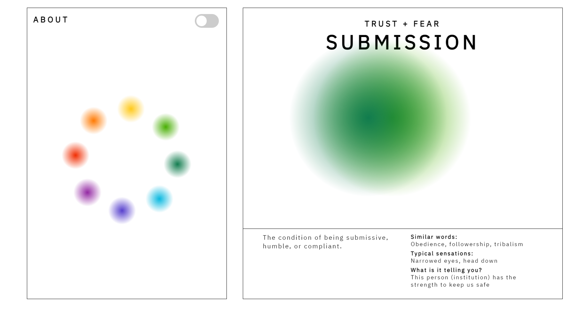
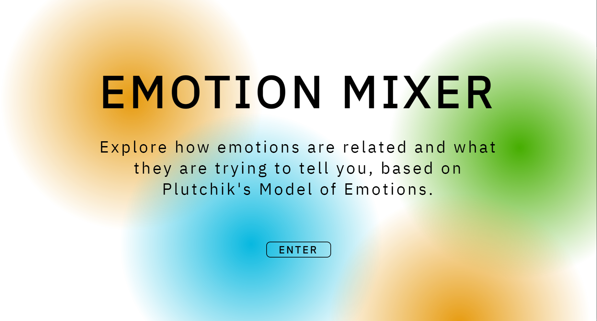

<h3 align="center">JavaScript Emotion Mixer</h3>

  

    Emotion mixer, built using html/css and JavaScript.
     
     
     
  

<!-- TABLE OF CONTENTS -->

  
Table of Contents

  <ol>
    <li>
      <a href="#about-the-project">About The Project</a>
      <ul>
        <li><a href="#built-with">Built With</a></li>
      </ul>
    </li>
    <li>
      <a href="#getting-started">Getting Started</a>
    </li>
    <li><a href="#usage">Usage</a></li>
    <li><a href="#contact">Contact</a></li>
    <li><a href="#acknowledgments">Acknowledgments</a></li>
  </ol>

<!-- ABOUT THE PROJECT -->
## About The Project

This project is a an "emotion mixer". It allows the user to select a color that holds a
corresponding emotion. The user can select up to 2 colours to reveal the emotion that both
emotions represent.

(<a href="#readme-top">back to top</a>)

### Built With

* [![hyper][HTML5]][HTML5-url]
* [![stylesheets][CSS3]][CSS3-url]
* [![java-script][JavaScript]][JavaScript-url]

(<a href="#readme-top">back to top</a>)

<!-- GETTING STARTED -->
## Getting Started

To view this project live select this link <a href="https://bburton0334.github.io/emotion_mixer/">emotion mixer</a>.
 
To check ou the source code, download the repo and start by opening "index.html" 

(<a href="#readme-top">back to top</a>)

<!-- USAGE EXAMPLES -->
## Usage

To use the program, all that is needed is to open "index.html" or view the live link.

 

Main page explaining the idea. Click the button to continue.

 

Application in action. Pick any colour and mix and match them in any order to reveal the emotions. 

(<a href="#readme-top">back to top</a>)

<!-- CONTACT -->
## Contact

Briana Burton - [in/briana-burton/](https://www.linkedin.com/in/briana-burton/) - brianareburton@gmail.com

Project Link: [https://github.com/bburton0334/emotion_mixer](https://github.com/bburton0334/emotion_mixer)

(<a href="#readme-top">back to top</a>)

<!-- ACKNOWLEDGMENTS -->
## Acknowledgments

* I am not responsible for someone maliciously copying this source code with the intent of submitting it as their own for an assignment.

(<a href="#readme-top">back to top</a>)

<!-- MARKDOWN LINKS & IMAGES -->
[ASP.NET]: https://img.shields.io/badge/asp.net-000000?style=for-the-badge&logo=.net&logoColor=white
[ASP.NET-url]: https://dotnet.microsoft.com/en-us/apps/aspnet
[C-sharp]: https://img.shields.io/badge/C%23-000000?style=for-the-badge&logo=csharp&logoColor=white
[Csharp-url]: https://docs.microsoft.com/en-us/dotnet/csharp/
[JSON]: https://img.shields.io/badge/json-000000?style=for-the-badge&logo=json&logoColor=white
[JSON-url]: https://www.json.org/json-en.html
[jQuery]: https://img.shields.io/badge/jquery-000000?style=for-the-badge&logo=jquery&logoColor=white
[jQuery-url]: https://jquery.com/
[HTML5]: https://img.shields.io/badge/html5-000000?style=for-the-badge&logo=html5&logoColor=white
[HTML5-url]: https://developer.mozilla.org/en-US/docs/Glossary/HTML5
[CSS3]: https://img.shields.io/badge/css3-000000?style=for-the-badge&logo=css3&logoColor=white
[CSS3-url]: https://developer.mozilla.org/en-US/docs/Web/CSS
[AJAX]: https://img.shields.io/badge/ajax-000000?style=for-the-badge&logo=ajax&logoColor=white
[AJAX-url]: https://developer.mozilla.org/en-US/docs/Web/Guide/AJAX
[JavaScript]: https://img.shields.io/badge/JavaScript-000000?style=for-the-badge&logo=javascript&logoColor=white
[JavaScript-url]: https://developer.mozilla.org/en-US/docs/Web/JavaScript
